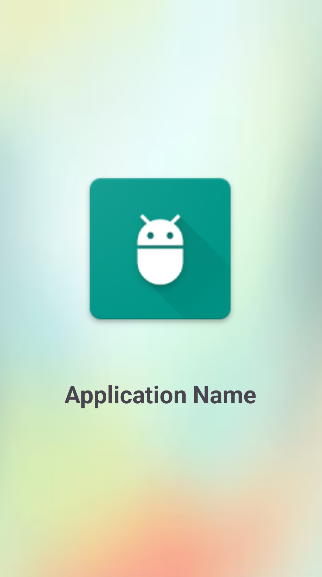
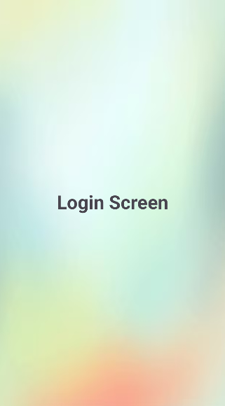

# SplashActivityApp
Splash Activity Android project showcasing app startup screen implementation using modern Android development practices.

---

## Features

* Splash Screen displayed on app launch
* Automatic transition to Login Activity
* Clean and simple user interface
* Beginner-friendly Android project
* Easy to understand project structure

---

## Tech Stack

* **Language:** Kotlin
* **IDE:** Android Studio
* **UI Design:** XML Layout
* **Platform:** Android

---

## Screenshots

### Splash Screen

---

## How to Run

1. Clone the repository:
2. Open the project in **Android Studio**
3. Let Gradle sync completely
4. Click **Run**
5. Select Emulator or Physical Device
